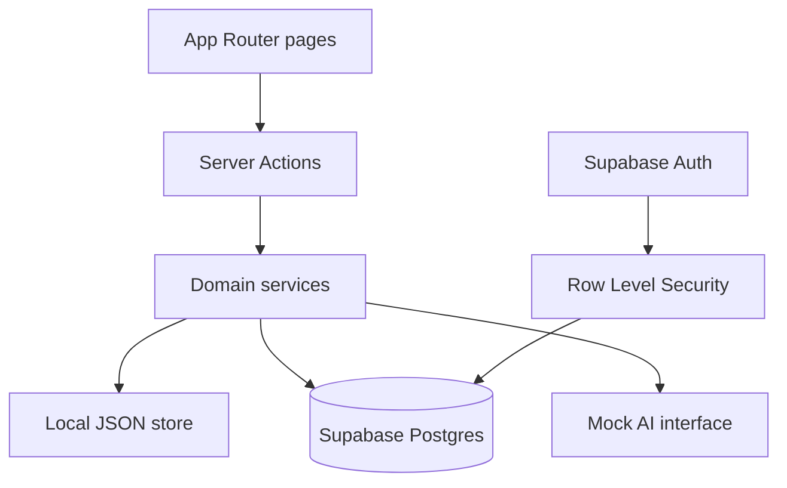
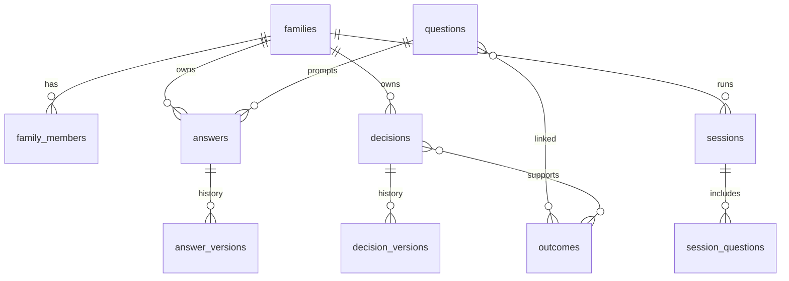

# Architecture

## Overview

Turner Family Principles is a Next.js App Router application with:

- TypeScript (strict)
- Tailwind CSS design system
- Zod validation
- Local JSON AppStore for **local development only**
- Shared remote JSONB AppStore (`USE_REMOTE_JSON_STORE=true`) on Vercel Preview/Production — no silent filesystem fallback
- Supabase Postgres + Auth + RLS for identity, research library, and the remote JSON bridge

## Layers

1. **Pages / layouts** — routing and composition only
2. **Components** — interview UI, libraries, forms
3. **Server actions** — validated writes + revalidation
4. **Services** — answers, sessions, decisions, playbook, search, stats, AI
5. **Store / DB** — remote JSONB on Vercel; local JSON only in development

## Data model

Full SQL schema: [`supabase/migrations/0001_init.sql`](../supabase/migrations/0001_init.sql)

## Security

- Family-scoped rows
- RLS policies via `user_family_ids()`
- No public answer/decision routes
- Activity log stores event metadata, not full private answer bodies in analytics

## Key product rules

- Never overwrite answer/decision history — version first
- Undecided and disagreement are valid results
- Separate answers can stay hidden until both are saved
- Cooling-off never locks a question
- AI outputs are stored separately and require approval
